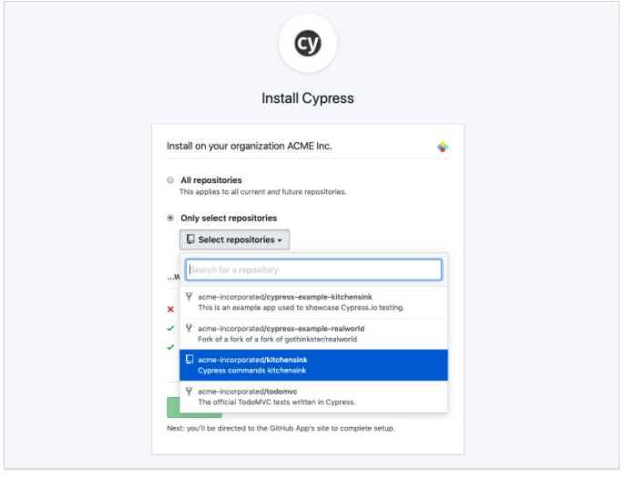

# Cypress를 이용한 CI 구성

## Cypress는 무엇인가? :question:

`cypress`는 FrontEnd, E2E (End To End) 테스팅 library이다.  
Selenium과는 다른 e2e테스팅 툴로서 nodejs 서버를 기반으로 구동됩니다.  
`chrome`, `firefox`, `electron`, `edge`, `brave` 브라우저 환경에 맞추어 e2e 테스트를 진행해 볼 수 있습니다.

nodejs를 기반으로 구동하면서 nodejs process와 완벽히 sync하여 움직입니다.

network layer에 접근하여 network요청을 직접 조작하는 것 또한 가능합니다.
이를 통해서 항상 일관된 결과를 확인하는 테스트를 작성하는게 가능합니다.

core concept과 diffrence는 공식 문서에도 잘 정리되어 있습니다. :books:  
:link: [Cypress's key Diffrences](https://docs.cypress.io/guides/overview/key-differences#Architecture)

## Cypress를 왜 사용하는가? 🤔

CI에 적용하기 위한 Testing library가 필요한게 핵심이었습니다.
테스트 로그를 통해 실패 케이스와 성공 케이스를 구분하는 것은 쉬운 일이었으나, github과 연동하여 해당 데이터를 쉽게 표시할 수 있는 library가 있으면 우선 선택할 계획이었습니다.

여러가지 testing library를 조사한 결과 다음과 같은 이유로 Cypress를 선택하게 되었습니다.

1. **dashBoard를 통한 monitoring**  
   cpyress는 `record`기능을 사용하면 dashboard에 testing기록을 남겨두게 됩니다. 이는 Component test(unit test), E2E (integration test) 모두 사용할 수 있습니다.
2. **github actions을 지원합니다.**  
   Cypress는 자체 개발한 cypress/gihub-actions를 가지고 있고 해당 기능을 통해 쉽게 actions를 이용할 수 있습니다.
3. **E2E, Unit 테스트를 모두 쉽게 구현할 수 있습니다.**  
   Cypress를 사용하는 core concept은 E2E testing 입니다.  
   하지만 우리는 개발을 하면서 unit test를 진행할 필요성이 있었습니다.  
   cypress의 component test를 이용하면 unit test를 구성할 수 있었습니다. 그리고, 두 가지를 다르게 설정하여 필요한 테스트를 원하는 시점에 진행할 수 있었습니다.
4. **react-testing-library와 호환됩니다.**
   이 밖에도 cypress는 react-testing-library에도 third-party모듈로 들어가 있어 creact-testing-library와 같이 호환하여 사용 할 수 있습니다.
   이를 통해 chai, jest, mocha등의 사용법을 같이 사용하는 것도 가능합니다.
   이러한 이점은 기존에 사용하였던 테스팅 방식인 mocha, chai, enzyme을 사용한 component 테스팅을 그대로 가져와 구성할 수 있게 해주었습니다.
   이로서 낮은 learning curve를 가져갈 수 있다는 이득이 있었습니다.

## Cypress Dashboard 사용하기

cypress의 dashboard는 공식 문서에도 나와 있습니다.

:link: [How to use DashBoard](https://docs.cypress.io/guides/dashboard/introduction#Integrate-with-Slack)

먼저 cypress를 local에 설치합니다.  
설치는 가이드를 통해 진행할 수 있습니다. :link: [가이드](https://docs.cypress.io/guides/getting-started/installing-cypress)

npm을 사용하고 계시다면 다음과 같은 방법으로 설치할 수 있습니다.

```bash
   $ cd /your/project/path
   $ npm i cypress -D # ues npm
   $ yarn add cypress --dev # use yarn
```

간단한 테스트 코드를 작성해봅니다.

```jsx
import { mount } from "@cypress/react";

const Test = <div>Hello World!</div>;

describe("Hello World Test", () => {
  it("Test Component", () => {
    mount(<Test />);
    cy.get("div").should("contains", "Hello World!");
  });
});
```

해당 테스트는 성공하는 테스트케이스 입니다.  
해당 코드를 cypresss itegration 폴더에 생성합니다.

cypress run-ct를 통해 component test를 진행할 수 있습니다. 특정 spec파일을 사용하려면 `-s` 옵션을 통해서 해당 스펙 파일을 실행 할 수 있습니다.

**cypress dashboard에 가입하기**
:link: [cypress dashboard 바로가기](https://www.cypress.io/dashboard/)

cypress dashboard는 cypressio에 회원가입하는 방식으로 사용 가능합니다.
organiztion을 생성하여 팀과 함께 사용하는 방식으로 사용할 수 있습니다.

1. organiation을 생성해줍니다.
2. cypress app을 git과 연동해 줍니다. (optional)
3. project를 생성합니다.
4. github actions를 통해 cypress test를 진행합니다.

2번 단계는 꼭 진행하지 않아도 상관 없으나, 이후 comment를 자동으로 남기기 위해 진행할 필요가 있습니다.

project는 integration의 설정을 변경하는데 사용합니다.

최초 1회는 메인으로 사용할 브랜치에서 로컬 테스틀 돌려 branch를 등록하는게 좋습니다.
이후에도 cypress dashboard settting에서 접근하기 쉽도록 도와줍니다.

github과 연동하기 위해 레포에 등록합니다.  
다음 과정에 따라 github cypress app을 내 repository에 등록하여 사용할수 있습니다.
https://docs.cypress.io/guides/dashboard/github-integration#Install-via-project-settings


다음 화면에서 내가 cypress CI를 사용할 `레포지토리`를 선택합니다.

project setting을 통해 레포지토리 정책을 정할 수 있습니다. 다만, 최초 프로젝트 등록시에는 레코딩 테스트를 1회 진행해야 합니다.

`cypress.json`에 `"projectId"`를 등록하고 record key를 통해 recording을 진행할 수 있습니다.
정상적으로 내 프로젝트 폴더에 cypress를 설치했다면, cypress.json이 자동적으로 생성되어 있습니다.

생성한 프로젝트 Id를 cypress.json에 설정한 뒤,  
레코딩 테스트를 진행하면

```bash
$ npx cypress run --record -k <record-key>
```

dashboard에테스팅 결과가 나타나는 것을 알 수 있습니다.  
이를 통해 프로젝트를 활성화 하면 이후에 설정등을 통해 CI에 적용할 수 있습니다.

## Github actions 사용하기

다음으로 actions를 통해 dashboard에 레코딩을 자동으로 남기도록 설정하는 방법입니다.

Cypress는 `github-actions`이외에도 circle CI등의 여러가지 CI용 툴에 적용할 수 있도록 가이드를 제공하고 있습니다.

해당 내용은 공식문서에 더 자세히 나와있습니다.

[공식문서 참고](https://docs.cypress.io/guides/continuous-integration/github-actions)

actions에 등록하기 위해 workflow파일을 생성하여 추가합니다.

```bash
   $ touch .github/workflow/main.yml
```

github의 프로젝트 레포지토리 > actions에서도 생성 가능합니다.


해당 workflow를 통해 다음과 같은 실행을 요청할 수 있습니다.

- project build
- project start (production setting)
- testing cypress

```yml
name: Cypress Tests

on: [push]

jobs:
  cypress-run:
    runs-on: ubuntu-latest
    steps:
      - name: Checkout
        uses: actions/checkout@v2
      # Install NPM dependencies, cache them correctly
      # and run all Cypress tests
      - name: Cypress run
        uses: cypress-io/github-action@v2
        with:
          build: npm run build
          start: npm start
```

`uses`를 통해 `cypress/github-actions` 모듈을 사용하고 있음을 알수 있습니다.

이는 workflow상에서 cypress를 통한 테스트를 진행할 수 있게 돕는 하나의 workflow파일이라고 생각하면 좋습니다.

with는 해당 모듈의 인풋을 설정하는 방식으로,  
`build`에 해당되는 스크립트와 `npm run build`  
`start`에 해당되는 스크립트를 실행하고 `npm start`  
`cypress run`을 실행하게 됩니다.

`cypress run`과 같은 경우는 기본적인 E2E테스트를 진행합니다.
component 테스트를 위해서는 다른 설정이 필요합니다.

`command` input을 통해 내가 원하는 유형의 테스트 스크립트를 실행하게 할 수 있습니다.

```yml
command: `npm run cypress:run-ct -- --record -b chrome -k ${{ secrets.CYPRESS_RECORD_KEY}}
```

`--`를 사용하면 스크립트 실행에 필요한 option값을 전달할 수 있습니다.  
command를 통해 cypress run-ct를 동작하게 됩니다.

이는 `package.json`에 반드시 스크립트로 등록되어있어야 실행 할 수 있습니다.

```json
// package.json
"script": {
   "cypress:run-ct": "cypress run-ct"
}
```

테스트 코드 실행 결과를 dashboard를 통해 확인하고 에러 상태를 github에서도 확인할 수 있습니다.

## Conclusion

Cypress는 프론트엔드에서 사용하기에 효과적인 테스팅 라이브러리 입니다.
서비스를 운영함에 있어서 E2E test는 사용자의 경험을 확인하는 큰 역할을 하고 있기 때문입니다.

또한, 개발을 진행함에 있어서 Unit test를 구성하고 개발에 반영하는게 통일성 있는 기능을 관리하는데 큰 기여를 할 수 있습니다.

TDD를 진행하는데 있어서 Cypress를 사용하는 것도 하나의 좋은 방법입니다.
