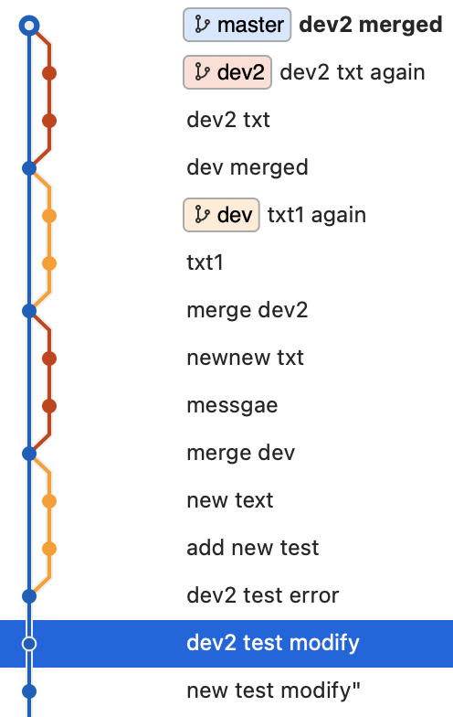

# 우리는 git-flow를 어떻게 적용하였는가?

> 이 글은 `우아한형제들` 기술 블로그의 내용을 포함하고 있습니다. 해당 글을 통해 저희팀의 git-flow 관리 전략을 정했고 사용한 경험을 작성했습니다.

:books: Ref ➡️ [우아한 형제들 기술 블로그 - 우리는 git-flow를 사용하고 있어요](https://techblog.woowahan.com/2553/)

## git-flow는 어떤 의미 일까요 :question:

git-flow는 배포, 개발, QA를 효과적으로 관리하기 위한 git 관리 전략중 하나입니다.

git-flow는 다음과 같은 diagram을 통해서 표현할 수 있습니다.


위와 같은 방식의 다중 브랜치를 통해서 현재 작업물의 상태를 어느정도 카테고리 형식으로 나눌 수 있습니다.

또한, fored repository에서 `feature branch`를 통해 개인단위의 작업이 가능합니다.

저희 팀은,  
`git-flow`에서 core concept라고 생각하는,

`master`, `release`, `dev`, `feature`  
네 가지 브랜치를 이용해 git을 관리하기로 정하였습니다.

## Git Convetion

조금만 사용해 보면,
브랜치를 나누는 것은 어려운일이 아닙니다.

`branch`를 어떻게 나누고 사용하는지는 팀에서 정하기 나름이기 때문에,  
저희가 어떻게 진행하는지만 간단한 상황 설명을 통해 말씀드리겠습니다.

### 기본적인 작업 방식

- repository
  - upstream : 공용 repository
  - origin : 개인 repository, forked repository
- branch
  - master: main branch (release version)
  - dev: develope branch
  - feature: 추가하는 feature와 관련된 branch

새로운 feature를 위한 branch는 `feature/CardName`의 방식으로 생성했습니다.  
`CardName`은 notion을 통해 관리하는 task Card의 `title`을 사용했습니다.

초기 상태의 repository는 통합으로 관리하는 upstream에서 받아올 수 있으며,  
해당 repository를 fork해서 사용합니다.

fork해온 개인 remote repository를 origin으로 설정하여 사용합니다.

현재 project repository에는 기본적으로 두 개의 branch가 생성되어 있습니다. `master`, `dev`가 생성되어 있으며, 새로운 feature를 생성하기 위해서는 `dev`에서 새로운 `branch`를 생성합니다.

`doSomething` 이라는 새로운 기능을 만든다고 가정하면
다음 과정으로 브랜치를 생성하고 작업을 진행합니다.

1. **먼저 현재 작업상태를 upstream에서 pull로 당겨 옵니다.**
   ```bash
   $ git pull upstream dev
   ```
2. **pull이 정상적으로 진행 되었다면, 새로운 브랜치로 분기 합니다.**
   ```bash
   $ git checkout -b feature/dosomething
   ```
3. **나만의 작업 및 commit을 생성합니다.** :wink:
   ```js
   // 내가 작업한 작고 귀여운 무언가
   $ git add /path/something/special/my/works
   $ git commit
   ```
4. **작업한 내용을 origin에 push합니다.**
   ```bash
   $ git push origin feature/dosomething
   ```
5. **PR을 통해 작업한 내용을 upstream에 반영합니다.**

이런 식의 관리전략이 기본으로 진행됩니다.

다만, 해당 방식은 작업의 순서나 브랜치를 확인하기 어려워 집니다.

> _이처럼 복잡한 형태의 브랜치 얽힘이 발생합니다._


다소 극단적인 모형이지만, feature에서 작업한다는 기본 규칙만 따를 때 발생할 수 있는 모형입니다.

이러한 문제를 해결하여,  
git log를 깔끔하게 하기 위한 rebase전략을 추가해서 사용합니다.

`rebase`는 `branch`의 분기 지점을 변경하는 행위라고 생각할 수 있습니다.  
추가적인 기능으로는 `commit`을 합치는 거나 변경하는 기능도 가능합니다.

> rebase는 사용하는데 주의해야 합니다.  
> 복수의 작업자가 rebase를 실시하는 경우, coflict가 발생 할수 있습니다.  
> rebase를 사용함에 있어서 공동 작업자와 협의를 하여 사용하는게 중요 합니다.

항상 최신 merge상태를 rebase로 하여 PR을 신청하는 방식으로 관리하게 된다면 다음과 같이 commit log를 변경할 수 있습니다.



### rebase를 통한 git log 관리

git log를 위의 그림처럼 쉽게 변경하기 위한 방법입니다.

PR을 통한 merge가 이뤄지면, 이후 PR이 이뤄지는 작업물의 base를 dev로 다시 변경합니다.
base가 최신 commit으로 변경되고 이후 PR은 merge를 진행합니다.

위와 같은 방식을 반복적으로 적용하면 깔끔한 git log를 관리할 수 있습니다.
각 단계를 세분화하여 알아보면,

merge 이전에 현재 브랜치를 rebase를 하기 위해서는 두 가지 방법을 사용할 수 있습니다.

- **pull과 함께 reabase를 하는 방법**  
  현재 작업중인 브랜치를 기준으로 진행 할수 있습니다.
  현재 작업중인 브랜치를 pull 받아온 브랜치의 최신 커밋으로 rebase를 하는 방법입니다.

  1. **rebase를 진행할 브랜치로 변경합니다. (작업중인 브랜치)**

  ```bash
  $ (dev) git checkout feature/dosomething
  ```

  2. **최신 버전의 dev에 rebase와 함께 pull을 실행합니다.**

  ```bash
    $ (feature/dosomething) git pull --rebase dev
  ```

  3. **conflict가 있는경우 conflict 내용을 수정하고 `--continue` 합니다.**

  ```bash
    # conflict 수정후 stage에 추가해야 합니다!
    $ (feature/dosomething|dev -i) git rebase --continue
  ```

  4. **PR을 요청합니다. (기존에 PR이 있다면 forece push를 통해 commit log를 변경할 수 있습니다)**

  ```bash
    $ (feature/dosomething) git push origin feature/dosomething -f
  ```

  > _foreced push는 해당 브랜치의 전체 커밋로그를 변경하는 과정을 진행하기 때문에, 진행하기전에 주의가 필요합니다._

- **일반적인 rebase를 진행하는 방법**  
  git의 rebase를 사용하는 일반적인 방법을 사용 할수 있습니다.

  ```bash
    $ git rebase dev feature/dosomething
  ```

  해당 방법은 git rebase를 명령어 사용 방법을 통해 자세히 살펴볼 수 있습니다.

## Conclusion

현재 저희 팀(JS)은 아직 배포 전략이 정해져 있지않아, dev까지만 branch를 관리하고 있습니다.
개발 과정에서의 commit을 조금 더 효율적으로 관리하고, 이후 release 버전과의 관계를 파악하기 쉽도록 commit을 관리하기 위한 전략을 찾던 중 배민에서 사용하는 git-flow 전략을 차용하게 되었고

저희가 사용하는 git관리 convetion과 혼용하여 사용하고 있습니다.
convetion은 commit message, issue managing등을 적용하였고 git-flow는 merge된 commit을 확인하는 과정에서 가독성, 가시성이 많이 좋아져 만족하고 있습니다.
