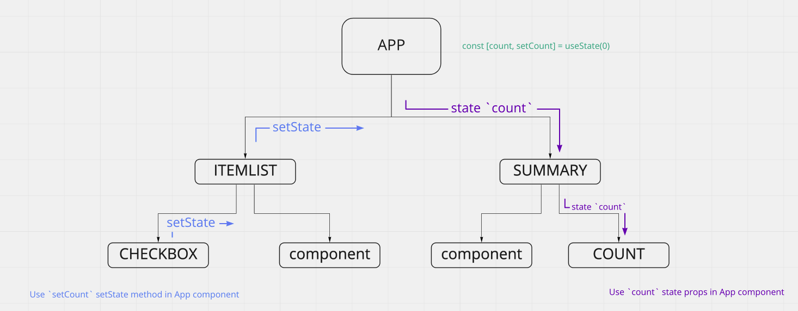
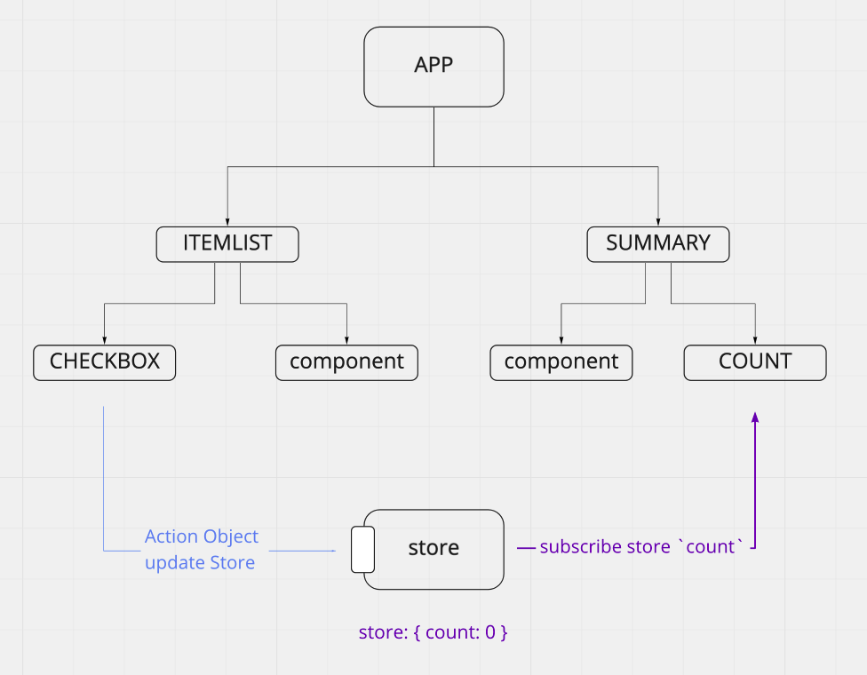

# Redux

## Redux란

> javascript 앱을 위한 상태 컨테이너

javascript 기반의 프로젝트에서 redux를 사용해 **전역 상태**를 설정하여,  
component가 직접 전역상태에 접근 할 수 있게 된다.

react를 위한 document가 잘 정리되어 있어 react에서의 사용율이 높고,  
다른 뷰 라이브러리(angular, vue)에서도 사용할 수는 있지만 각 라이브러리 마다의 상태관리 reducer를 사용한다.

## redux가 왜 필요한가?

redux를 통해 전역에서 사용할 수 있는 `state store`(상태 저장소)를 생성하여 접근이 가능하다.  
component는 해당 store의 state를 구독하여 component의 상태를 업데이트 할 수 있고  
component에서 dipatch를 통해 store를 업데이트 할 수 있게 된다.

- **store가 없는 것과 어떤 차이가 있을까?**

  state와 setState의 위치가 다른 경우에는 state lifting, state drilling이 일어나게 된다.  
  
  이 상태는 관련이 없는 component가 props를 통해서 state의 변화를 전달해야하고,  
  공통 부모 컴포넌트에서 state를 설정하여 관리해야하는 불편함이 있다.

  이런 경우에는 redux를 이용해 개선할 수 있다.  
  
  스토어는 앱에서 하나만 존재하며, 해당 공간은 어떠한 컴포넌트에서도 접근할 수 있다.

## redux의 조건

1. 단일 스토어

- store가 하나만 존재하며, 상태 변화를 계속 같은곳에서만 발생하도록 한다.

2. immutable state

- store는 Read only로 사용하며, 값을 변화하기 위한 방법은 action을 통해서만 할 수 있다.

3. pure function (순수함수)

- reducer는 반드시 pure function(순수함수)로 작성하여, store의 변화를 프로그램이 항상 예측할 수 있어야 한다.

- **Flux structure**  
  플럭스 구조는 데이터의 단방향 흐름을 나타낸다.  
  데이터의 변화는 반드시 action을 통해 이루어지며,  
  변화된 데이터를 store에 저장하여 view가 해당 store를 구독해 변화를 인지하고 UI를 변경하는 형태로 구현된다.

## redux의 동작 방식

1.  전역에서 접근 가능한 store를 생성한다.  
    `store`는 createStore를 통해 생성하고 react-redux의 provier component로 제공한다.  
    `Provider`로 감싸져있는 component에서는 store에 접근할 수 있게 된다.

```js
// index.js
import reducer from "./reducer.js";

let store = creatStore(reducer);
ReactDOM.render(
  <Provier store={store}>
    <App />
  </Provider>,
  document.getElementById("root")
);
```

2. action은 dispatch를 통해 reducer에 전달 된다.

```js
// actions.js
export const PRINT = "print";

const actionPrint = (text) => {
  return {
    type: PRINT,
    payload: {
      text,
    },
  };
};

dispatch(actionPrint("hello")); // == dispatch({ type:PRINT, payload:'hello' })
```

dispatch에 인자로 들어간 action creator가 특정한 action object를 reducer에 전달하게 된다.

3. reducer는 action을 갑지하여 state(store)를 변경한다.

```js
// reducer.js
import { PRINT } from "./action";
import { initialState } from "./initialState";
const reducer = (state = initialState, action) => {
  switch (action.type) {
    case PRINT:
      return {
        ...state,
        text: action.payload.text,
      };
    default:
      return state;
  }
};
```

리듀서가 위와 같이 있다면, `state`는 store의 역할을 하고 있으며, dispatch를 통해 action인자를 받게 된다.  
그 대마다 새로운 state를 생성하여 내보내고 다음 dispatch호출 시에는 가장 최신의 state(store)를 업데이트 하게 된다.

4. component는 store를 구독하여 component 고유의 상태처럼 사용한다.

```js
// Print.js
import React, { useSelector } from "react";

const Print = () => {
  const text = useSelect((state) => state.text);
  return <div>{text}</div>;
};
```

store의 상태를 가져와 렌더링 한다. store의 값이 바뀌면 리렌더하게 된다.

## 결론

redux를 통해 전역 state를 만들어 어떤 컴포넌트에서도 쉽게 값을 업데이트 하고 받아 올 수 있다.  
이러한 이점을 통해 기존 방식보다 쉽게 state를 관리할 수 있게 된다.  
하지만, 규모가 작거나 state가 필요 없는 경우 서버간의 통신이 적거나 없는 경우에는 효용이 떨어질 수 있다.
