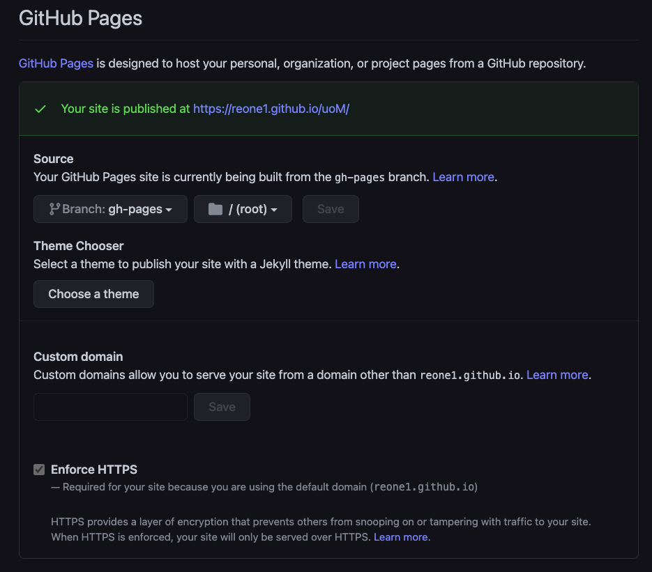
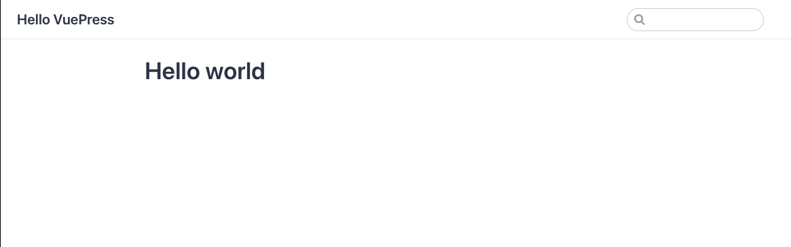

# TIL-20210320

## github page로 블로그 만들기 📚

여태까지 벨로그(velog)를 통해서 블로그를 작성했었다.
원래 그때그때 알아본 내용을 Notion에 모아 뒀다가 blog에 옮기는 방식으로 TIL을 많이 작성했는데,
두 가지 모두 markdown을 사용하기 때문에 쉽게 내용을 변형 할 수 있어서 편리했다.

그래서, markdown을 사용하는 블로그를 사용하면서 내가 페이지를 자유롭게 만들어 볼 수 없을까?  
라는 생각에 이곳 저곳을 찾아봤다.

마침 **github page**가 가장 적절해 보였다.

1.  github repo를 사용하기 때문에 쉽게 글을 작성할 수 있다.
2.  별도의 도메인 세팅 없이도 페이지를 쉽게 배포 할 수 있다.
3.  마크다운을 사용한다.
4.  내 마음데로 컴포넌트를 사용한다.

그러면 어떻게 github page를 원하는 방식에 맞게 변형 시킬 수 있을까?  
**vuepress**라는 framework를 알게 되었다.

`*.md` 파일을 기반으로 정적사이트를 빌드하여 배포하기 때문에,  
github에서 사용하던 markdown을 그대로 옮겨와 파일로 작성하는게 편해 보였다.

vuejs를 한번도 다뤄본적은 없지만,  
이번기회에 간단하게만 사용해보는것도 재미있을 것 같아 시도해보았다.

## github page 설정 :blue_book:

github repository는 settings 설정을 통해서 해당 페이지의 브랜치, 폴더 등을 정적파일로 배포할 수 있다.
이 곳에서 브랜치를 정하고 어떤 경로를 root directory로 설정할 것인지 정하면 된다.



## vuepress로 정적 페이지 배포하기 🍎

먼저 내가 블로그의 내용을 채울 레포를 만든다.

```sh
$ mkdir *내가 만들 레포 이름*; cd *내가 만든 레포 이름*
```

nodejs 프로젝트로 초기화 한다.  
vuepress를 설치한다.

```sh
$ npm i
$ npm install --dev vuepress
```

이제부터는 vuepress의 공식 문서를 매우 주의깊게 찾아보면 쉽게 따라 갈 수 있다.  
vuepress의 파일을 담아줄 docs 폴더를 만든다.

```sh
$ mkdir docs
```

먼저 `.vuepress` 폴더(directory)를 만든다.

그리고, `vuepress`에서 사용할 `config.js`을 생성한다.

```sh
$ mkdir .vuepress; cd .vuepress
$ touch config.js
```

vuepress documents에 있는 기본 설정을 일단 붙여 넣어 보았다.

```js
// .vuepress/config.js
module.exports = {
  title: "Hello VuePress",
  description: "Just playing around",
};
```

그리고, root dir에 README.md를 작성한다.

```js
// README.md
# Hello World
```

이제 docs에 생성되는 `*.md`파일 들을 `.vuepress`에 빌드해서 사이트를 확인 할 준비가 끝났다.

`package.json`에서 script를 작성해 nodepress를 실행 해보자

```js
// package.json
{
  /* ... other props */
  script: {
    "dev": "vuepress dev docs",
    "build": "vuepress build docs",
  }
  /* ... other props */
}
```

`build`는 배포를 위해서 정적 파일을 생성하기 위한 script이다.
`dev`를 실행하게 되면, 로컬에서 정적파일 배포 페이지가 어떻게 나오게 될지 확인 해 볼 수 있다.

```sh
$ npm run dev
```

다음과 같은 페이지가 배포 되었음을 확인 할 수 있다. `localhost:8080`


# 마무리

간단한 배포 과정을 알아볼 수 있었다.  
 다음에는 내가 빌드한 파일을 어떻게 github page에 배포할 수 있는지 알아보자
