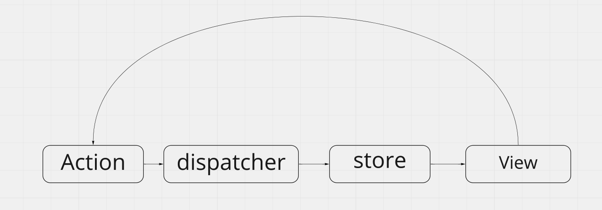

# TIL-20210405

## todays

- redux란
- redux-thunk
- redux middleware

## content

### redux란?

javascript 앱을 위한 상태 컨테이너,  
지금은 `React`에 적용하여 사용하고 있지만, component환경이 아니어도 값의 변화를 저장하고 사용할 수 있다.

- **왜 redux를 사용하는가?**

  작은 규모의 서비스라면 component가 많지 않고, 상태 또한 복잡하지 않기 때문에 문제가 없다.  
  서비스가 확장되는 과정에서 다양한 컴포넌트가 생기고, 그에 따른 상태도 추가되게 된다.

  기존의 state 전달 방식은 props를 통한 전달이기 때문에, `state drilling`같은 문제가 생기게 된다.  
  로직상의 큰 문제는 없지만, 코드의 가독성이 떨어지고 비효율적인 props들이 많이 생기게 된다.  
  \*\*state Drilling - 상위 컴포넌트의 state를 하위 컴포넌트로 계속해서 전달해 목표 컴포넌트까지 props를 통해 전달하는 행위

- **redux pattern**

  redux는 Flux 구조를 통해 state 컨테이너의 역할을 한다.

  - `Flux 구조`  
    데이터 흐름을 한방향으로 정해서 store의 업데이트를 반드시 action을 통해서만 하도록 한다.

    

    `store`의 업데이이트가 `dipatcher`를 통한 `action` 객체를 통해 이루어지기 때문에,  
    `store`의 상태를 예측하기 쉽다.

    또한 `dipatcher`를 순수함수 형태로 구현해,  
    `store`와 `action`를 통해 항상 정해진 방식의 `store`변화를 정할 수 있다.

  - 단일 스토어(store)  
    App에는 하나의 스토어만 두어 여러개의 스토어를 구독하여 발생할 수 있는 혼란을 피한다.
    `dispatcher`동작간에 하나의 스토어 상태를 구독하는데, 해당 스토어가 어딘지 찾기 어려워 진다.  
    그로인해 생기는 혼란을 찾아내 수정하는 것도 어려워 진다.

    때문에, `store`안에서 여러가지 `reducer`를 조합하여 하나의 store로 생성한다.  
    `combineReducers`메서드를 사용해 여러개의 `reducer`를 하나의 `store`로 구성할 수 있다.

### redux Thunk

기존에 리덕스에서 비동기 처리를 위해서는 dipatch인자를 계속해서 넘겨주어 연쇄동작이 일어나도록 해야했지만,
redux Thunk를 이용해 편리하게 dispatch method를 호출할 수 있게 된다.

- without middleware

```js
// action creator
function loadData(dispatch, userId) { // needs to dispatch, so it is first argument
  return fetch(`http://data.com/${userId}`)
    .then(res => res.json())
    .then(
      data => dispatch({ type: 'LOAD_DATA_SUCCESS', data }),
      err => dispatch({ type: 'LOAD_DATA_FAILURE', err })
    );
}

// component
componentWillMount() {
  loadData(this.props.dispatch, this.props.userId); // don't forget to pass dispatch
}
```

- with middleware(thunk)

```js
// action creator
function loadData(userId) {
 return dispatch => fetch(`http://data.com/${userId}`) // Redux Thunk handles these
   .then(res => res.json())
   .then(
     data => dispatch({ type: 'LOAD_DATA_SUCCESS', data }),
     err => dispatch({ type: 'LOAD_DATA_FAILURE', err })
   );
}

// component
componentWillMount() {
 this.props.dispatch(loadData(this.props.userId)); // dispatch like you usually do
}
```

이처럼 문법에는 큰 차이가 없지만,  
`action creator`가 함수인 경우에는 자동으로 `dipatch` 함수를 넘겨주어 쉽게 `action`을 생성할 수 있게 된다.  
`redux`의 `syntactic sugar`라고 볼 수 있다.

### thunk와 saga

리덕스 middleware에는 thunk와 saga가 많이 쓰이는데, 두 가지의 큰 차이는 없고 문법적인 차이가 있다.  
 또한 비동기 처리 과정에서 반복 호출이나, 처리 과정에 대한 핸들링을 saga에서는 할 수 있다.

saga는 기본 문법 구조가 javascript와 차이점이 있어 자유롭게 다루기위한 러닝커브가 있는 편이다.  
[thunk vs saga](https://gracefullight.dev/2017/12/06/Why-redux-saga/)

## next

미들웨어를 직접 custom해서 붙여보기
[redux middleware sample](https://youtu.be/xsOhUX7DDl0)
