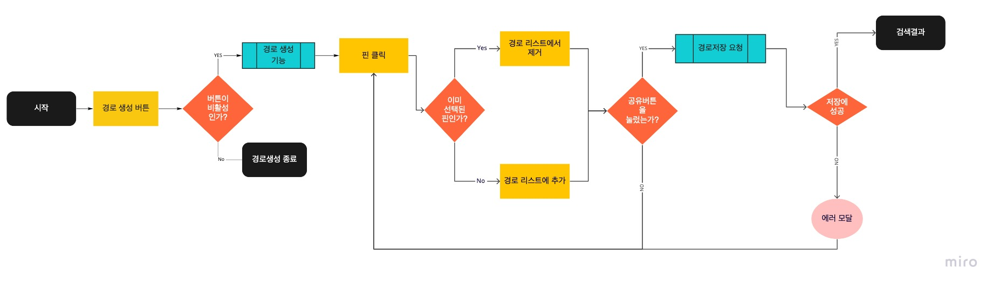

# TIL-20210513

# Today

- FlowChart 작성방법
- 프로젝트 library reference check

# Content

## FlowChart 작성 방법

플로우차트(flowchart)의 작성 방법은 알고리즘 순서도 기호를 이용하여 작성한다.  
 서비스의 흐름도를 기능이나 페이지 단위로 분리하여 해당 순서도를 표현하는 방법이 가장 보편적이다.

이번 프로젝트를 준비하면서 우리 서비스에 대한 플로우차트를 구성하며 사용한 방식을 간단하게 보면,
(이번 프로젝트에서는 담당 부분이 FrontEnd여서 Client 부분만 준비했다...)

**경로생성 Flowchart**

각 기호의 표시에 따라 몇 가지를 구분 할 수 있다.  
 이미지 구분을 쉽게 하기 위해 색상을 주었다. 일반적으로는 색상이 아닌 기호를 통해 각 분기를 구별한다.

- 라운드 사각형 기호 (검은색) : 각 로직의 시작과 종료 지점을 표시한다.
- 직사각형 기호 (노란색) : 사용자 행동
- 마름모 (주황색) : 논리 기호 (yes or not)
- 3칸 직사각형 (녹색) : 기능 실행
- 원 (분홍색) : 일반적인 다음 단계 (페이지 변화를 이쪽에 배치했다.)

플로우 차트를 제대로 작성해보는게 처음이라 아직 많은 기호에 대해 사용처를 파악하기 어려웠다.
일단 이해하고 있는 기호들을 배치하여 작성했다.

## 프로젝트 library reference check

이번 프로젝트에서는 그 기능이 많고 실제 개발 기간이 3주정도로 테스크 관리가 중요할 것이라 판단했다.
때문에, 프론트에서는 작업 시간대비 효율이 많이 낮은 기능들을 외부 라이브러리를 선택하기로 하였고 외부 라이브러리를 사용하기로 하는 리스트를 다음과 같이 정했다.

**리스트**

- Map API
- Datepicker
- WYSIWYG

일단 prototype 작업을 위해 꼭 필요한 기능을 가지고 리스트 업해보았는데, 이후에 추가될 가능성이 있어 보인다.
**Map API**  
 맵 API는 카카오, 구글, 등 많은 라이브러리가 있었는데,  
 문서를 알아보기 쉽고 필요한 기능에 대한 레퍼런스 코드가 쉽게 구성되어 있는 카카오 API를 사용하기로 하였다.

**DatePicker**
우리는 기간에 대한 정보를 쉽게 작성할 수 있는 Datepicker가 필요했다.
때문에, 레퍼런스 체크를 하는데 중요하게 생각한 부분은,

1.  쉽게 커스텀이 되어야 한다. (디자인 통일성을 가져가기 위해)
2.  기간 선택이 쉬어야 한다. (달력을 넘기거나 인풋 조절을 사용자가 인식하기 편해야 한다.)
3.  데이터 출력을 원하는 방식으로 컨트롤 할 수 있어야 한다.

대부분 3번 요건은 비슷한 형식의 데이터를 출력해주었고, localization 기능이 잘 정돈되어 있었다.  
 기간 선택에 대한 전략이 각 라이브러리 마다 조금 차이가 있었고, 우리는 airbnb datepicker가 우리가 선호하는 방식의 입력방식이라 해당 라이브러리를 선택했다.

# Finally

플로우 차트 작성은 생각보다 어렵지 않았다. 하지만, 우리가 작성한 방식이 누구나 쉽게 이해할 수 있는 방식인지 아직 잘 모르겠다는 물음표가 남아있다.
내일은 실제 우리가 작업한 프로젝트 문서들을 최종 컨펌하고 코드 베이스를 구축할 것이다.
