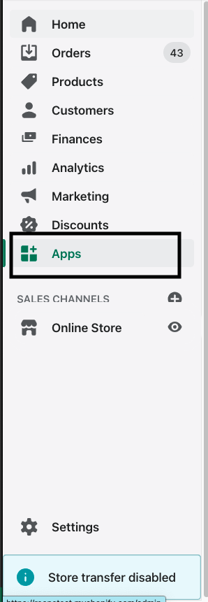
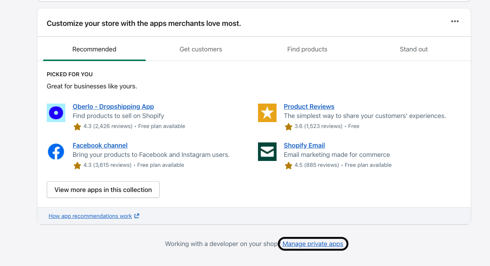
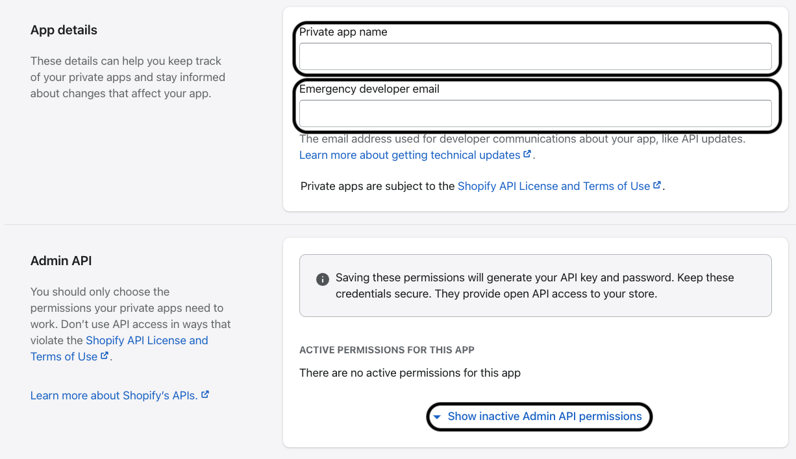
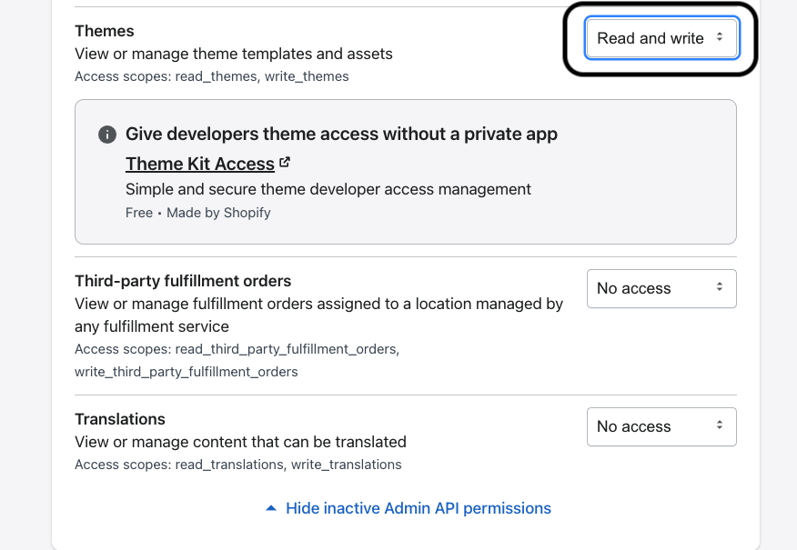

# shopify에서 tamplate theme을 수정하는 방법

## shopify를 통해 web page 구성하기

shopify는 store management를 위한 global service입니다.
해당 서비스에서 web page template을 수정하는 방법중 한가지를 소개하려 합니다.

shopify는 기본 template를 갖추고 있습니다.
무료 템플릿 중 원하는 템플릿을 가지고 custom해서도 사용할 수 있습니다.

template는 가입후 store theme을 통해서 확인할 수 있습니다.


theme이라는 메뉴에서 free template를 선택해 원하는 방식으로 수정해서 사용하면 됩니다.

## Liquid

shopify template은 Liquid라는 template 언어로 구성되어 있습니다.
해당 문법은 다음 공식문서를 통해 확인할 수 있습니다.

[liquid 공식문서](https://shopify.github.io/liquid)

해당 template language는 shopify에서 만든 open source형태의 template언어 입니다.

shopify를 이용하면서 template을 수정해야한다면 자주 사용하게 될 template언어 입니다.

크게 복잡한 형식은 아니지만 간단하게 몇 가지 특징적인 부분을 살펴보면,

1. **`{{ }}`를 통해서 script를 작성합니다.**
   조건문, 변수선언 및 사용, keyword 활용등은 `{{ "keyword" }}`, `{{ "if <조건문>" }}`등 이런 형식으로 사용합니다.

2. **작성된 문서는 모두 web에 plain text형태로 작성 됩니다. (web)**  
   템플릿 안에 `script` tag를 이용해 inline javascript를 작성하면, 해당 라인을 web에서 실행하며 script를 실행하게 됩니다.

다른 문법적인 부분은 문서에서 살펴보시면 됩니다.

## themekit

themekit은 idle을 이용해 liquid template을 수정하기 위해 사용하는 하나의 package입니다.

shopify에서도 공식 문서에 설명을 구성해뒀기 때문에, 정확한 사용법은 guide를 따라서 진행하시면 됩니다.

[theme kit 설정 가이드](https://shopify.dev/themes/tools/theme-kit)

themekit을 brew등의 package menager를 통해서 설치 합니다.

```bash
$ brew tap shopify/shopify
$ brew install themekit
```

이후, themekit을 통해 내 store theme에 접근하는 여러가지 방법중 private app을 설정하여 접근하는 방법입니다.

App 메뉴를 선택하고



privateApp 메뉴로 이동합니다.



createApp 통해서 theme에 접근할 수 있는 권한만 선택 후 save합니다.





이제는 생성된 설정에서 password를 가져와 사용할 수 있습니다.
password에 해당되는 부분을 클립보드에 복사해 해당 password에 넣어 사용할 수 있습니다.

```bash
$ theme get --password=[your-password] --store="[your-store.myshopify.com]" --themeid=[your-theme-id]
```

theme id는 list를 조회해 확인할 수 있습니다.

list는 다음 명령어로 조회합니다.

```bash
$ theme get --list -p=[password] -s="my-store.myshopify.com"
```

이제 내려받은 theme을 수정해 반영하기 위헤 deploy, watch를 통해서 theme변경사항을 적용할 수 있습니다.

[배포관련 reference](https://shopify.dev/themes/tools/theme-kit/command-reference#deploy)
