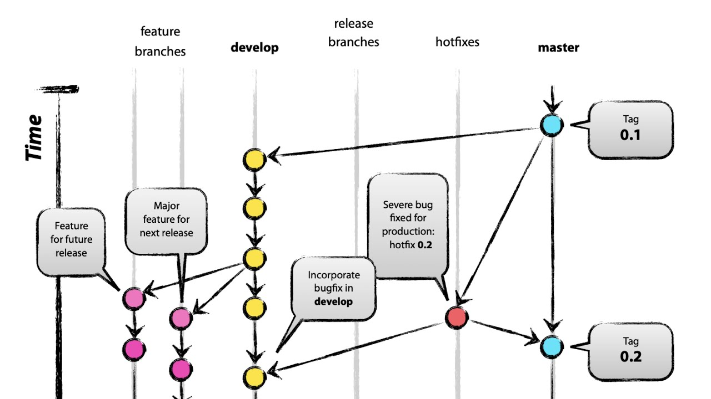

# 우리는 git-flow를 어떻게 적용하였는가?

> 이 글은 `우아한형제들` 기술 블로그의 내용을 포함하고 있습니다. 해당 글을 통해 저희팀의 git-flow 관리 전략을 정했고 사용한 경험을 작성했습니다.  
> reference: [우아한 형제들 기술 블로그 - 우리는 git-flow를 사용하고 있어요](https://techblog.woowahan.com/2553/)

## git-flow는 어떤 의미 일까요 :question:

git-flow는 배포, 개발, QA를 효과적으로 관리하기 위한 git 관리 전략중 하나입니다.

git-flow는 다음과 같은 diagram을 통해서 표현할 수 있습니다.

위와 같은 방식의 다중 브랜치를 통해서 현재 작업물의 상태를 어느정도 카테고리 형식으로 나눌 수 있습니다.

또한, fored repository에서 `feature branch`를 통해 개인단위의 작업이 가능합니다.

저희 팀은,  
`git-flow`에서 core concept라고 생각하는,

`master`, `release`, `dev`, `feature`  
네 가지 브랜치를 이용해 git을 관리하기로 정하였습니다.

## git convetion

조금만 사용해 보면,
브랜치를 나누는 것은 어려운일이 아닙니다.

새로운 feature를 위한 branch는 `feature/CardName`의 방식으로 생성했습니다.
`CardName`은 notion을 통해 관리하는 task Card의 `title`을 사용했습니다.

먼저 forked 해온 remote branch를 origin으로 설정하여 사용합니다.
